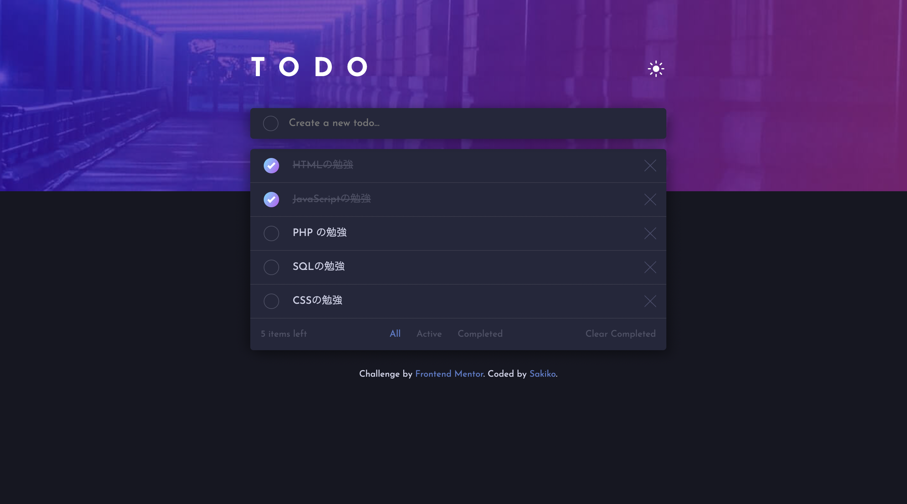
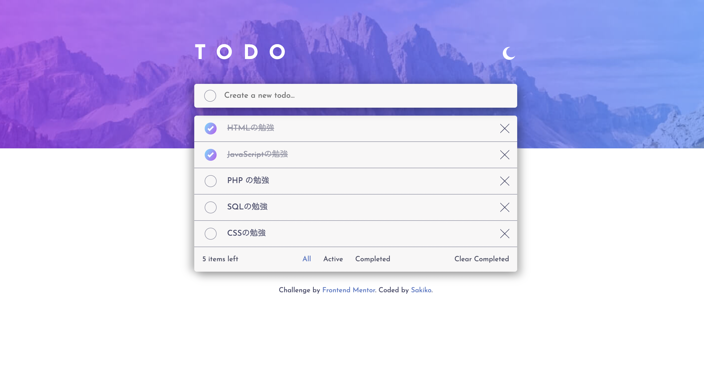

# Frontend Mentor - Todo app solution

This is a solution to the [Todo app challenge on Frontend Mentor](https://www.frontendmentor.io/challenges/todo-app-Su1_KokOW). Frontend Mentor challenges help you improve your coding skills by building realistic projects. 

## Table of contents

- [Overview](#overview)
  - [The challenge](#the-challenge)
  - [Screenshot](#screenshot)
  - [Links](#links)
- [My process](#my-process)
  - [Built with](#built-with)
  - [What I learned](#what-i-learned)
  - [Continued development](#continued-development)
- [Author](#author)

## Overview

### The challenge

Users should be able to:

- View the optimal layout for the app depending on their device's screen size
- See hover states for all interactive elements on the page
- Add new todos to the list
- Mark todos as complete
- Delete todos from the list
- Filter by all/active/complete todos
- Clear all completed todos
- Toggle light and dark mode

### Screenshot

### Links

- Live Site URL: [URL](https://mariit12321.github.io/todo_app/)

## My process

### Built with

- HTML
- Sass
- Flexbox
- CSS Grid
- JavaSctipt
- Local Storage

### What I learned

JavaScriptのアウトプットを目的に、本アプリケーションを作成しました。
JavaScriptの関数やLocalStorageの処理、イベントリスナー、for文などについて理解を深めることができました。

### Continued development

今後はReact.jsやVue.jsを学習する予定なので、それぞれ学習後に再度作成してみたいです。

## Author

- Website - [Sakiko Kunii](https://twitter.com/mariit12321)
- Twitter - [@mariit12321](https://twitter.com/mariit12321)

